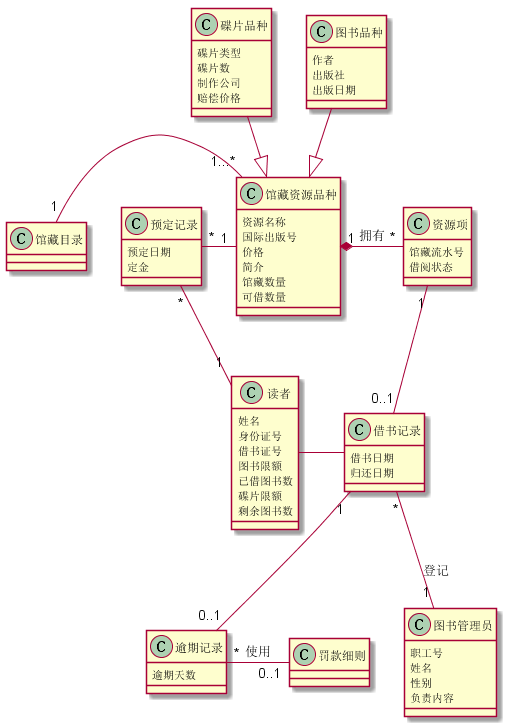
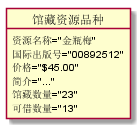
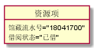
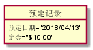
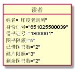
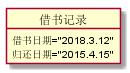
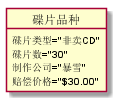
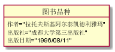
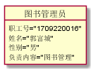

<<<<<<< HEAD
# 实验3：图书管理系统领域对象建模
<table>
<tr>
<td>学号</td>
<td>班级</td>
<td>姓名</td>
<td>照片</td>
</tr>
<tr>
<td>201510414303</td>
<td>15级软件三班</td>
<td>洪志凌</td>
<td></td>
</tr>
</table>

##  1. 图书管理系统的类图

### 1.1 类图PlantUML源码如下：

``` class
@startuml
馆藏目录"1"-"1...*"馆藏资源品种
预定记录"*"-"1"馆藏资源品种
预定记录"*"--"1"读者
读者-借书记录
逾期记录"*"-"0..1"罚款细则:使用
馆藏资源品种"1"*-"*"资源项:拥有
资源项"1"--"0..1"借书记录
借书记录"*"--"1"图书管理员:登记
借书记录"1"--"0..1"逾期记录
碟片品种--|>馆藏资源品种
图书品种--|>馆藏资源品种

class 馆藏资源品种{
   资源名称
   国际出版号
   价格
   简介
   馆藏数量
   可借数量
}

class 碟片品种{
   碟片类型
   碟片数
   制作公司
   赔偿价格
}

class 图书品种{
   作者
   出版社
   出版日期
}


class 资源项{
   馆藏流水号
   借阅状态
}

class 预定记录{
   预定日期
   定金
}

class 借书记录{
   借书日期
   归还日期
}

class 读者{
   姓名
   身份证号
   借书证号
   图书限额
   已借图书数
   碟片限额
   剩余图书数

}

class 图书管理员{
   职工号
   姓名
   性别
   负责内容
}

class 逾期记录{
   逾期天数
}
@enduml
```

### 1.2. 类图如下：


### 1.3. 类图说明：
此图说明了图书馆的馆藏书籍的相关信息以及馆藏碟片的相关信息，
对于图书管理系统的读者身份信息和技术相关信息也有详细描述，还
包括了图书管理员的相关信息。

## 2. 图书管理系统的对象图
### 2.1 馆藏资源品种的对象图
#### 源码如下：
``` class
@startuml
object 馆藏资源品种{
 资源名称="金瓶梅"
 国际出版号="00892512"
 价格="$45.00"
 简介="..."
 馆藏数量="23"
 可借数量="13"
 }
@enduml
```
#### 对象图如下：


### 2.2 资源项的对象图
#### 源码如下：
``` class
@startuml
object 资源项{
馆藏流水号="18041700"
状态="已借"
}
@enduml
```
#### 对象图如下：


### 2.3 预定记录的对象图
#### 源码如下：
``` class
@startuml
object 预定记录{
  预定日期="2018/04/13"
  定金="$10.00"
}
@enduml
```
#### 对象图如下：


### 2.4 读者的对象图
#### 源码如下：
``` class
@startuml
object 读者{
   姓名="印度老斑鸠"
   身份证号="651025580039"
   图书限额="5"
   已借图书数="2"
   碟片限额="3"
   剩余图书数="2"
}
@enduml
```
#### 对象图如下：


### 2.5借书记录的对象图
#### 源码如下：
``` class
@startuml
object 借书记录{
     借书日期="2018.3.12"
     归还日期="2015.4.15"
}
@enduml
```
#### 对象图如下：


### 2.6 读者的对象图
#### 源码如下：
``` class
@startuml
object 碟片品种{
    碟片类型="非卖CD"
    碟片数="30"
    制作公司="暴雪"
    赔偿价格="$30.00"
}
@enduml
```
#### 对象图如下：


### 2.7 图书品种的对象图
#### 源码如下：
``` class
@startuml
object 图书品种{
    作者="拉托夫斯基阿尔泰凯德利雅玛"
    出版社="成都大学第三出版社"
    出版日期="1996/08/11"
}
@enduml
```
#### 对象图如下：


### 2.8 图书管理员的对象图
#### 源码如下：
``` class
@startuml
object 图书管理员{
    职工号="1709220016"
    姓名="郭富城"
    性别="男"
    负责内容="图书管理"
}
@enduml
```
#### 对象图如下：
=======
# 实验3：图书管理系统领域对象建模
<table>
<tr>
<td>学号</td>
<td>班级</td>
<td>姓名</td>
<td>照片</td>
</tr>
<tr>
<td>201510414303</td>
<td>15级软件三班</td>
<td>洪志凌</td>
<td></td>
</tr>
</table>

##  1. 图书管理系统的类图

### 1.1 类图PlantUML源码如下：

``` class
@startuml
馆藏目录"1"-"1...*"馆藏资源品种
预定记录"*"-"1"馆藏资源品种
预定记录"*"--"1"读者
读者-借书记录
逾期记录"*"-"0..1"罚款细则:使用
馆藏资源品种"1"*-"*"资源项:拥有
资源项"1"--"0..1"借书记录
借书记录"*"--"1"图书管理员:登记
借书记录"1"--"0..1"逾期记录
碟片品种--|>馆藏资源品种
图书品种--|>馆藏资源品种

class 馆藏资源品种{
   资源名称
   国际出版号
   价格
   简介
   馆藏数量
   可借数量
}

class 碟片品种{
   碟片类型
   碟片数
   制作公司
   赔偿价格
}

class 图书品种{
   作者
   出版社
   出版日期
}


class 资源项{
   馆藏流水号
   借阅状态
}

class 预定记录{
   预定日期
   定金
}

class 借书记录{
   借书日期
   归还日期
}

class 读者{
   姓名
   身份证号
   借书证号
   图书限额
   已借图书数
   碟片限额
   剩余图书数

}

class 图书管理员{
   职工号
   姓名
   性别
   负责内容
}

class 逾期记录{
   逾期天数
}
@enduml
```

### 1.2. 类图如下：


### 1.3. 类图说明：
此图说明了图书馆的馆藏书籍的相关信息以及馆藏碟片的相关信息，
对于图书管理系统的读者身份信息和技术相关信息也有详细描述，还
包括了图书管理员的相关信息。

## 2. 图书管理系统的对象图
### 2.1 馆藏资源品种的对象图
#### 源码如下：
``` class
@startuml
object 馆藏资源品种{
 资源名称="金瓶梅"
 国际出版号="00892512"
 价格="$45.00"
 简介="..."
 馆藏数量="23"
 可借数量="13"
 }
@enduml
```
#### 对象图如下：


### 2.2 资源项的对象图
#### 源码如下：
``` class
@startuml
object 资源项{
馆藏流水号="18041700"
状态="已借"
}
@enduml
```
#### 对象图如下：


### 2.3 预定记录的对象图
#### 源码如下：
``` class
@startuml
object 预定记录{
  预定日期="2018/04/13"
  定金="$10.00"
}
@enduml
```
#### 对象图如下：


### 2.4 读者的对象图
#### 源码如下：
``` class
@startuml
object 读者{
   姓名="印度老斑鸠"
   身份证号="651025580039"
   图书限额="5"
   已借图书数="2"
   碟片限额="3"
   剩余图书数="2"
}
@enduml
```
#### 对象图如下：


### 2.5借书记录的对象图
#### 源码如下：
``` class
@startuml
object 借书记录{
     借书日期="2018.3.12"
     归还日期="2015.4.15"
}
@enduml
```
#### 对象图如下：


### 2.6 读者的对象图
#### 源码如下：
``` class
@startuml
object 碟片品种{
    碟片类型="非卖CD"
    碟片数="30"
    制作公司="暴雪"
    赔偿价格="$30.00"
}
@enduml
```
#### 对象图如下：


### 2.7 图书品种的对象图
#### 源码如下：
``` class
@startuml
object 图书品种{
    作者="拉托夫斯基阿尔泰凯德利雅玛"
    出版社="成都大学第三出版社"
    出版日期="1996/08/11"
}
@enduml
```
#### 对象图如下：


### 2.8 图书管理员的对象图
#### 源码如下：
``` class
@startuml
object 图书管理员{
    职工号="1709220016"
    姓名="郭富城"
    性别="男"
    负责内容="图书管理"
}
@enduml
```
#### 对象图如下：
>>>>>>> 软件分析
