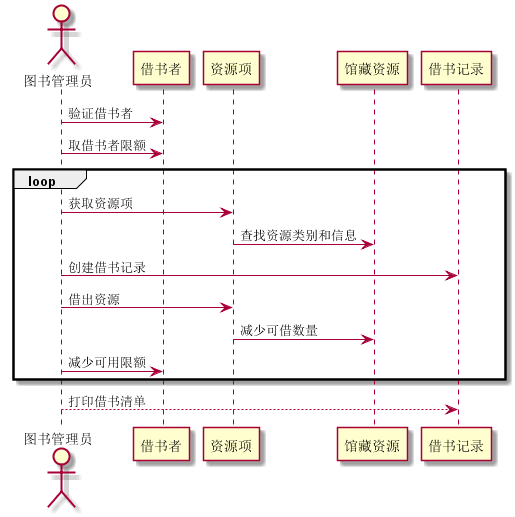

<<<<<<< HEAD
# 实验4 图书管理系统顺序图绘制
|    学号    |       班级       |      姓名     |    照片    | 
|:-------:|:------------- | ----------:|----------:|
|   201510414303  |     2015级3班    |   洪志凌   |   |

* **根据之前实验的用例图和类图，画出部分用例的顺序图包括：<br>
1.借书；<br>
2.还书；<br>
3.查找图书；<br>
4.预订图书、解除预订；<br>
5.查找用户信息；<br>
6.更新图书、更新借书者；<br>
7.删除和添加功能** *

## 1.借书顺序图
### 1.1 代码如下 ：
      @startuml
             actor 图书管理员
             图书管理员->借书者:验证借书者
             图书管理员->借书者:取借书者限额
             loop
             图书管理员->资源项:获取资源项
             资源项->馆藏资源:查找资源类别和信息
             图书管理员->借书记录:创建借书记录
             图书管理员->资源项:借出资源
             资源项->馆藏资源:减少可借数量
             图书管理员->借书者:减少可用限额
             end
             图书管理员-->借书记录:打印借书清单
       @enduml
### 1.2 顺序图如下：
   
  * **说明:<br>
  借书首要步骤：<br>
  1.验证借书者信息和可借阅额度；<br>
  2.由图书管理员发起借书请求；<br>
  3.系统减少资源可借数量和可借额度；<br>
  4.创建新的借书记录。**

## 2.还书顺序图
### 2.1 代码如下：
```
    @startuml
        actor 图书管理员
        actor 借书者用户
        图书管理员->借书者用户:读取借书者信息
        借书者用户->资源项:读取资源信息
        资源项->借书记录:取借书记录
        资源项->馆藏资源:取资源的类别和信息
        借书者用户->资源项:归还资源
        资源项->馆藏资源:增加可借数量
        图书管理员->借书记录:登记还书日期
        opt 逾期
        图书管理员->逾期记录:登记逾期记录
        借书者-->图书管理员:交付罚金
        end
    @enduml
```
### 2.2 顺序图如下：

* **说明:<br>
1.还书首先要验证借书者信息；<br>
2.由图书管理员发起还书请求；<br>
3.增加资源可借数量和可借额度，<br>
4.然后登记还书日期（若用户逾期，还需进行逾期记录和罚款）。**

## 3.查找图书顺序图
### 3.1 代码如下：
```
    @startuml
        actor 系统管理员
        actor 图书管理员
        actor 借书者
        系统管理员->资源项:获取资源项
        图书管理员->资源项:获取资源项
        借书者->资源项:获取资源项
        资源项->馆藏资源:查找资源类别和信息
        馆藏资源->图书书目:查找图书
        图书书目-->系统管理员:返回图书
        图书书目-->图书管理员:返回图书
        图书书目-->借书者:返回图书
    @enduml
```
### 3.2 顺序图如下：

* **说明:<br>
1.查找图书由资源项管理；<br>
2.在馆藏资源中，图书书目继承馆藏资源，直接通过书名，ISBN，作者等项目查找图书**

## 4.查找用户个人信息顺序图
### 4.1 代码如下：
```
    @startuml
        actor 借书者用户
        借书者用户->借书者:查询帐户信息
        借书者-->借书者用户:返回帐户信息
        借书者->预订记录:查找预订记录
        预订记录-->借书者用户:返回预订信息
        借书者->借书记录:查找借书记录
        借书记录-->借书者用户:返回借书信息
        alt
        借书记录->逾期记录:查找逾期记录
        逾期记录-->借书者用户:返回逾期信息
        逾期记录->罚款记录:查找罚款记录
        罚款记录-->借书者用户:返回罚款信息
        end
    @enduml
```
### 4.2 顺序图如下：

* **说明:<br>
1.查找用户信息有用户个人信息；<br>
2.1查找预订记录，<br>
2.2有借书记录，<br>
2.3有逾期记录和罚款记录**

## 5.预订图书顺序图
### 5.1 代码如下：
```
    @startuml
        actor 图书管理员
        图书管理员->借书者:验证借书者
        图书管理员->借书者:取借书者限额
        loop
        图书管理员->资源项:获取资源项
        资源项->馆藏资源:查找资源品种
        图书管理员->预订记录:创建预定记录
        资源项->馆藏资源:减少可借数量
        预定记录-->借书者:借书成功
        end
        图书管理员->预订记录:打印预定清单
    @enduml
```
### 5.2 顺序图如下：

* **说明:<br>
1.预订图书首先验证借书者信息和额度；<br>
2.再由图书管理员发起预订；<br>
3.减少图书资源可借数目；<br>
4.创建用户预订记录，打印预订清单**

## 6.解除预订顺序图
### 6.1 代码如下：
```
@startuml
    actor 图书管理员
        图书管理员->借书者:验证借书者
        图书管理员->预订记录:取预定记录
        图书管理员->预订记录:标记预定记录
    @enduml
```
### 6.2 顺序图如下：

* **说明:<br>
1.解除预订先验证借书者信息；<br>
2.查找有无预订记录；<br>
3标记预订记录（表明此条记录已经失效）。**

## 7.更新图书顺序图
### 7.1 代码如下：
```
    @startuml
        actor 系统管理员
        系统管理员->资源项:获取资源项信息
        资源项->馆藏资源:查询资源信息
        馆藏资源->图书书目:查询书目信息
        系统管理员->图书书目:更新书目信息
    @enduml
```
### 7.2 顺序图如下：

* **说明:<br>
1.更新图书由系统管理员操作；<br>
2.由馆藏资源找到图书书目；<br>
3.更新图书书目（添加图书书目）操作；<br>
4.删除图书操作需要先进行查找操作**

### 8.更新用户顺序图
#### 8.1 代码如下：
```
    @startuml
        actor 系统管理员
        系统管理员->借书者用户:查找借书者用户
        借书者用户-->系统管理员:返回借书者用户信息
        系统管理员->借书者用户:更新借书者用户信息
    @enduml
```
### 8.2 顺序图如下：

* **说明:<br>
1.更新借书者由系统管理员操作；<br>
2.更新借书者（添加借书者）操作；<br>
=======
# 实验4 图书管理系统顺序图绘制
|    学号    |       班级       |      姓名     |    照片    | 
|:-------:|:------------- | ----------:|----------:|
|   201510414303  |     2015级3班    |   洪志凌   |   |

* **根据之前实验的用例图和类图，画出部分用例的顺序图包括：<br>
1.借书；<br>
2.还书；<br>
3.查找图书；<br>
4.预订图书、解除预订；<br>
5.查找用户信息；<br>
6.更新图书、更新借书者；<br>
7.删除和添加功能** *

## 1.借书顺序图
### 1.1 代码如下 ：
      @startuml
             actor 图书管理员
             图书管理员->借书者:验证借书者
             图书管理员->借书者:取借书者限额
             loop
             图书管理员->资源项:获取资源项
             资源项->馆藏资源:查找资源类别和信息
             图书管理员->借书记录:创建借书记录
             图书管理员->资源项:借出资源
             资源项->馆藏资源:减少可借数量
             图书管理员->借书者:减少可用限额
             end
             图书管理员-->借书记录:打印借书清单
       @enduml
### 1.2 顺序图如下：
   
  * **说明:<br>
  借书首要步骤：<br>
  1.验证借书者信息和可借阅额度；<br>
  2.由图书管理员发起借书请求；<br>
  3.系统减少资源可借数量和可借额度；<br>
  4.创建新的借书记录。**

## 2.还书顺序图
### 2.1 代码如下：
```
    @startuml
        actor 图书管理员
        actor 借书者用户
        图书管理员->借书者用户:读取借书者信息
        借书者用户->资源项:读取资源信息
        资源项->借书记录:取借书记录
        资源项->馆藏资源:取资源的类别和信息
        借书者用户->资源项:归还资源
        资源项->馆藏资源:增加可借数量
        图书管理员->借书记录:登记还书日期
        opt 逾期
        图书管理员->逾期记录:登记逾期记录
        借书者-->图书管理员:交付罚金
        end
    @enduml
```
### 2.2 顺序图如下：

* **说明:<br>
1.还书首先要验证借书者信息；<br>
2.由图书管理员发起还书请求；<br>
3.增加资源可借数量和可借额度，<br>
4.然后登记还书日期（若用户逾期，还需进行逾期记录和罚款）。**

## 3.查找图书顺序图
### 3.1 代码如下：
```
    @startuml
        actor 系统管理员
        actor 图书管理员
        actor 借书者
        系统管理员->资源项:获取资源项
        图书管理员->资源项:获取资源项
        借书者->资源项:获取资源项
        资源项->馆藏资源:查找资源类别和信息
        馆藏资源->图书书目:查找图书
        图书书目-->系统管理员:返回图书
        图书书目-->图书管理员:返回图书
        图书书目-->借书者:返回图书
    @enduml
```
### 3.2 顺序图如下：

* **说明:<br>
1.查找图书由资源项管理；<br>
2.在馆藏资源中，图书书目继承馆藏资源，直接通过书名，ISBN，作者等项目查找图书**

## 4.查找用户个人信息顺序图
### 4.1 代码如下：
```
    @startuml
        actor 借书者用户
        借书者用户->借书者:查询帐户信息
        借书者-->借书者用户:返回帐户信息
        借书者->预订记录:查找预订记录
        预订记录-->借书者用户:返回预订信息
        借书者->借书记录:查找借书记录
        借书记录-->借书者用户:返回借书信息
        alt
        借书记录->逾期记录:查找逾期记录
        逾期记录-->借书者用户:返回逾期信息
        逾期记录->罚款记录:查找罚款记录
        罚款记录-->借书者用户:返回罚款信息
        end
    @enduml
```
### 4.2 顺序图如下：

* **说明:<br>
1.查找用户信息有用户个人信息；<br>
2.1查找预订记录，<br>
2.2有借书记录，<br>
2.3有逾期记录和罚款记录**

## 5.预订图书顺序图
### 5.1 代码如下：
```
    @startuml
        actor 图书管理员
        图书管理员->借书者:验证借书者
        图书管理员->借书者:取借书者限额
        loop
        图书管理员->资源项:获取资源项
        资源项->馆藏资源:查找资源品种
        图书管理员->预订记录:创建预定记录
        资源项->馆藏资源:减少可借数量
        预定记录-->借书者:借书成功
        end
        图书管理员->预订记录:打印预定清单
    @enduml
```
### 5.2 顺序图如下：

* **说明:<br>
1.预订图书首先验证借书者信息和额度；<br>
2.再由图书管理员发起预订；<br>
3.减少图书资源可借数目；<br>
4.创建用户预订记录，打印预订清单**

## 6.解除预订顺序图
### 6.1 代码如下：
```
@startuml
    actor 图书管理员
        图书管理员->借书者:验证借书者
        图书管理员->预订记录:取预定记录
        图书管理员->预订记录:标记预定记录
    @enduml
```
### 6.2 顺序图如下：

* **说明:<br>
1.解除预订先验证借书者信息；<br>
2.查找有无预订记录；<br>
3标记预订记录（表明此条记录已经失效）。**

## 7.更新图书顺序图
### 7.1 代码如下：
```
    @startuml
        actor 系统管理员
        系统管理员->资源项:获取资源项信息
        资源项->馆藏资源:查询资源信息
        馆藏资源->图书书目:查询书目信息
        系统管理员->图书书目:更新书目信息
    @enduml
```
### 7.2 顺序图如下：

* **说明:<br>
1.更新图书由系统管理员操作；<br>
2.由馆藏资源找到图书书目；<br>
3.更新图书书目（添加图书书目）操作；<br>
4.删除图书操作需要先进行查找操作**

### 8.更新用户顺序图
#### 8.1 代码如下：
```
    @startuml
        actor 系统管理员
        系统管理员->借书者用户:查找借书者用户
        借书者用户-->系统管理员:返回借书者用户信息
        系统管理员->借书者用户:更新借书者用户信息
    @enduml
```
### 8.2 顺序图如下：

* **说明:<br>
1.更新借书者由系统管理员操作；<br>
2.更新借书者（添加借书者）操作；<br>
>>>>>>> 软件分析
4.删除图书操作需要先进行查找操作** 