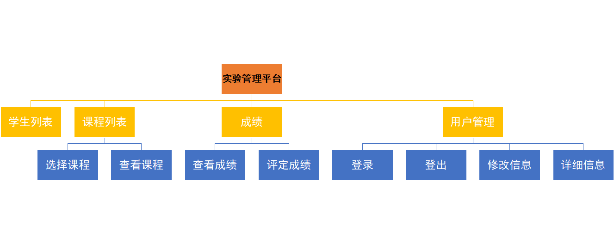
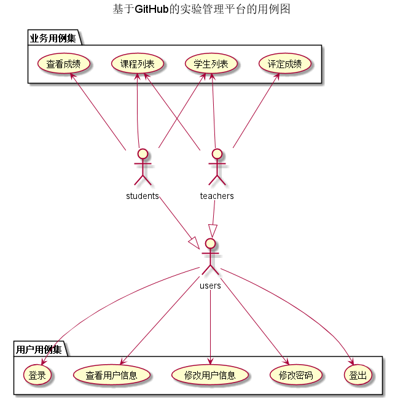
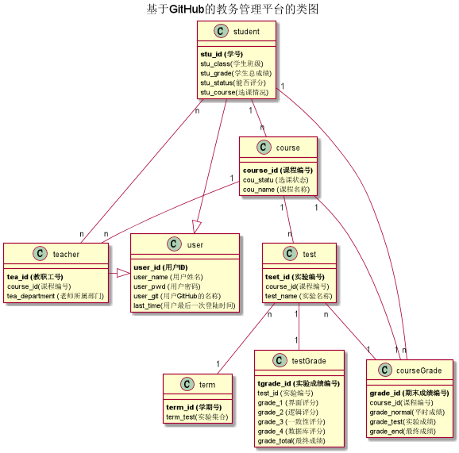

# 基于GitHub的实验管理平台的分析与设计
### 成都大学信息科学与工程学院 软件工程
|学号|班级|姓名|
|:-------:|:--------:|:--------:|
|201510414303|软件工程3班|洪志凌|

## 1.基于GitHub的实验管理平台概述
- 基于GitHub的实验管理平台的作用是在线管理实验成绩的Web应用系统。学生和老师的实验内容均存放在GitHUB 页面上。
- 学生的功能主要有：①修改自己的GitHub用户名②查询自己三门课的实验成绩。(备注:学生的GitHub用户名是公开的，但成绩不公开)
- 老师的功能主要有：①批改每个学生的成绩，②查看每个学生的成绩。
- 老师和学生都能通过本系统的学生列表链接方便地跳转到学生的各个GitHUB实验目录。
- 实验成绩按数字分数计算，每项实验的满分为100分，最低为0分。
- 实验成绩综合打分：界面、逻辑、一致性、数据库四个方面进行评分
- 系统自动计算某门科目中每个学生的所有实验的平均分和所有科目的最后加权平均分。

## 2.系统总体结构

## 3.界面设计
* [参照界面](https://giftedhong.github.io/is_analysis/test6/ui/index.html)

## 4.用例图设计 [源码](puml/用例图.puml)

## 5.类图设计 [源码](puml/类图.puml)

## 6.数据库设计
- ### [参见数据库设计](md/数据库设计.md)

## 7.用例及界面详细设计
#### 界面中会有多身份使用，希望使用时切换用户以获得更好的体验感，对该基于GitHub的实验管理平台的分析与设计也会有更深入的了解。 
   | |用例|界面|
   |-----|---|----|
   |登录|[用例](md/md登录用例.md)|[界面](https://giftedhong.github.io/is_analysis/test6/ui/login.html)|
   |登出|[用例](md/md登出用例.md)|[界面](https://giftedhong.github.io/is_analysis/test6/ui/logout.html)|
   |学生列表|[用例](md/md学生列表用例.md)|[界面](https://giftedhong.github.io/is_analysis/test6/ui/index.html)|
   |课程列表|[用例](md/md课程列表用例.md)|[界面](https://giftedhong.github.io/is_analysis/test6/ui/studentcourse.html)|
   |选择课程|[用例](md/md选择课程用例.md)|[界面](https://giftedhong.github.io/is_analysis/test6/ui/studentchoose.html)|
   |查看成绩|[用例](md/md查看成绩用例.md)|[界面](https://giftedhong.github.io/is_analysis/test6/ui/studentgrade.html)|
   |查看评语|[用例](md/md查看评语用例.md)|[界面](https://giftedhong.github.io/is_analysis/test6/ui/studentgrade.html)|
   |评定成绩|[用例](md/md评定成绩用例.md)|[界面](https://giftedhong.github.io/is_analysis/test6/ui/teachercorrect.html)|
   |查看信息|[用例](md/md查看信息用例.md)|[界面](https://giftedhong.github.io/is_analysis/test6/ui/viewuser.html)|
   |修改信息|[用例](md/md修改信息用例.md)|[界面](https://giftedhong.github.io/is_analysis/test6/ui/modifyuser.html)|
   |修改密码|[用例](md/md修改密码用例.md)|[界面](https://giftedhong.github.io/is_analysis/test6/ui/modifypwd.html)|

