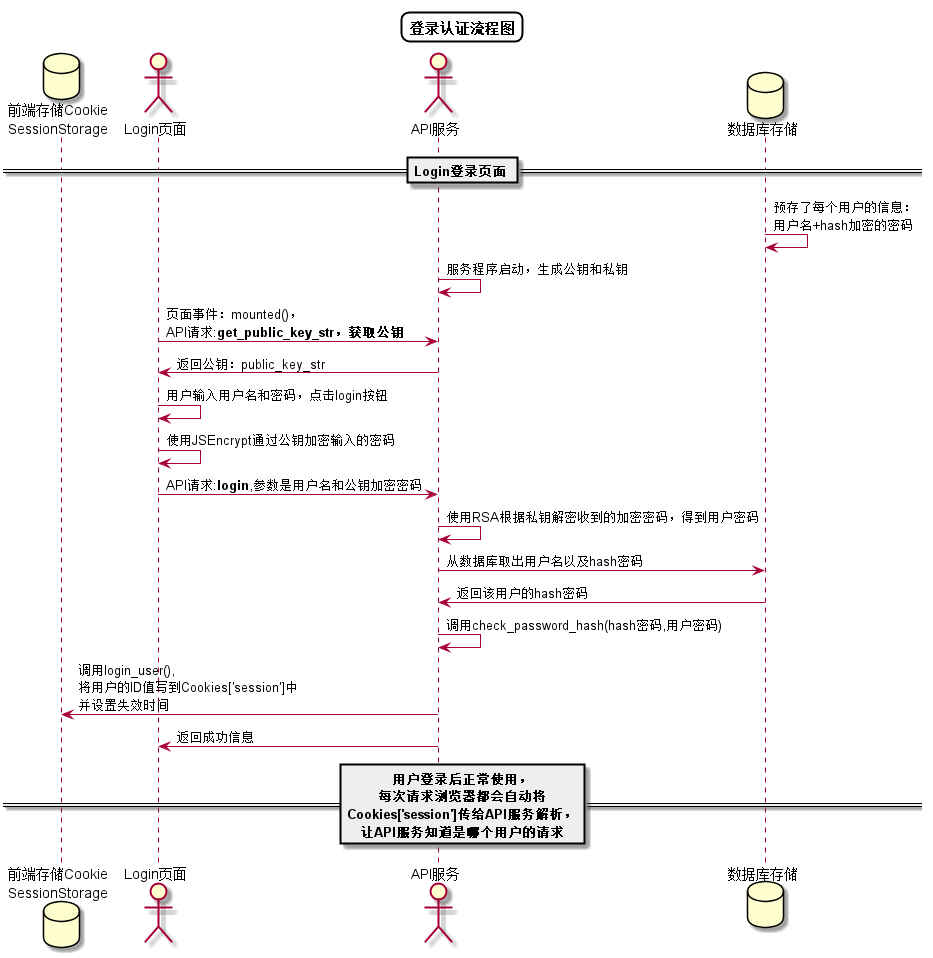

# [←](../README.md) “修改密码”用例

## 1.用例规约
|用例名称|修改密码|
|-----|-----|
|功能 | 修改用户的密码|
|参与者 | 学生，老师|
|前置条件|必须先登录|
|后置条件|修改密码以后必须强制登出，再跳转到登录页面|
|主事件流|1.用户填写新密码（两次输入）  2.用户提交修改信息  3.系统存储修改后密码|
|备选事件流|1. 用户两次输入的密码不同   2.系统提示两次输入的密码不相同 3.用户重新填写并提交。|

## 2.业务流程（顺序图）
无

## 3.界面设计
- 界面参照
    - https://giftedhong.github.io/is_analysis/test6/ui/modifypwd.html
- API接口调用
    - 接口：[修改密码接口](../others/setPassword.md)

## 4. 算法描述
源码：[PUML](../puml/puml登录认证流程图.puml)

## 5. 参照表
- [USER](数据库设计.md/#USER)
- [STUDENT](数据库设计.md/#STUDENT)
- [TEACHER](数据库设计.md/#TEACHER)
- [TERM](数据库设计.md/#TERM)
- [TEST](数据库设计.md/#TESTS)
- [TESTGRADE](数据库设计.md/#TESTGRADE)
- [COURSE](数据库设计.md/#COURSE)
- [COURSEGRADE](数据库设计.md/#COURSEGRADE)
