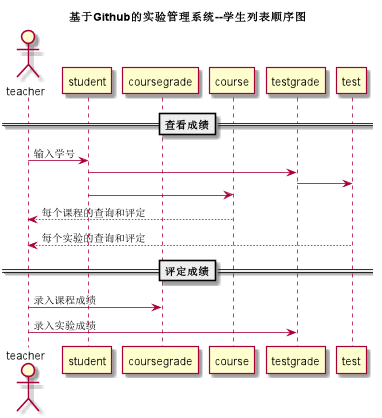

# [←](../README.md) “评定成绩”用例

##1.用例规约
|用例名称|评定成绩|
|-----|-----|
|功能 | 老师评定一个学生的实验成绩|
|参与者 | 老师|
|前置条件|查看成绩：评定成绩之前，老师需要先登录，并显示出一个学生的所有实验成绩和评语信息|
|后置条件|评定成绩提交之后，系统自动设置成绩更新日期为当前日期，自动计算平均成绩|
|主事件流|	1. 查看已有的成绩  2. 输入一个或者多个实验的成绩和评语  3. 提交  4. 系统存储实验成绩和评语5. 系统自动计算平均成绩 |
|备选事件流|1.成绩必须是0至100之间，可以为空，但不能超界  2.提示用户重新输入成绩分数|

##2.业务流程（顺序图）
###顺序图源码：[PUML文件](../puml/puml评定成绩顺序图.puml)

##3.界面设计
- 界面参照
    - https://giftedhong.github.io/is_analysis/test6/ui/teachergrade.html

- API接口调用
    - 接口1：[查看/评定成绩接口](../others/getOneStudentResults.md)

        用于显示一个学生的所有实验成绩和评语
    - 接口2：[取得下一个学生学号接口](../others/getOneStudentResults.md)

        用于取得上一个或者下一个学生的学号
    - 接口3：[设置学生成绩评语接口](../others/getOneStudentResults.md)

        用于设置一个学生的部分实验成绩和评语

## 4. 算法描述
无

## 5. 参照表
- [USER](数据库设计.md/#USER)
- [STUDENT](数据库设计.md/#STUDENT)
- [TEACHER](数据库设计.md/#TEACHER)
- [TERM](数据库设计.md/#TERM)
- [TEST](数据库设计.md/#TESTS)
- [TESTGRADE](数据库设计.md/#TESTGRADE)
- [COURSE](数据库设计.md/#COURSE)
- [COURSEGRADE](数据库设计.md/#COURSEGRADE)