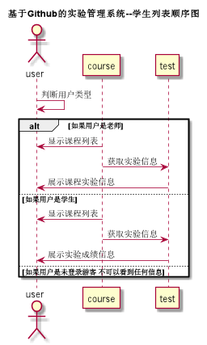

# [←](../README.md) “查看课程”用例

## 1.用例规约
|用例名称|课程列表|
|-----|-----|
|功能 | 用列表展示所有课程信息|
|参与者 | 游客，老师，学生|
|前置条件|学生，老师需要登录|
|后置条件||
|主事件流||
|备选事件流||

## 2.业务流程（顺序图）
###顺序图源码：[PUML文件](../puml/puml课程列表顺序图.puml)

## 3.界面设计
- 界面参照
    - 老师身份：https://giftedhong.github.io/is_analysis/test6/ui/teachercourse.html
    - 学生身份：https://giftedhong.github.io/is_analysis/test6/ui/studentcourse.html
- API接口调用
    - 接口：[获取课程列表](../others/getstudent.md)

## 4. 算法描述
无

## 5. 参照表
- [USER](数据库设计.md/#USER)
- [STUDENT](数据库设计.md/#STUDENT)
- [TEACHER](数据库设计.md/#TEACHER)
- [TERM](数据库设计.md/#TERM)
- [TEST](数据库设计.md/#TESTS)
- [TESTGRADE](数据库设计.md/#TESTGRADE)
- [COURSE](数据库设计.md/#COURSE)
- [COURSEGRADE](数据库设计.md/#COURSEGRADE)
